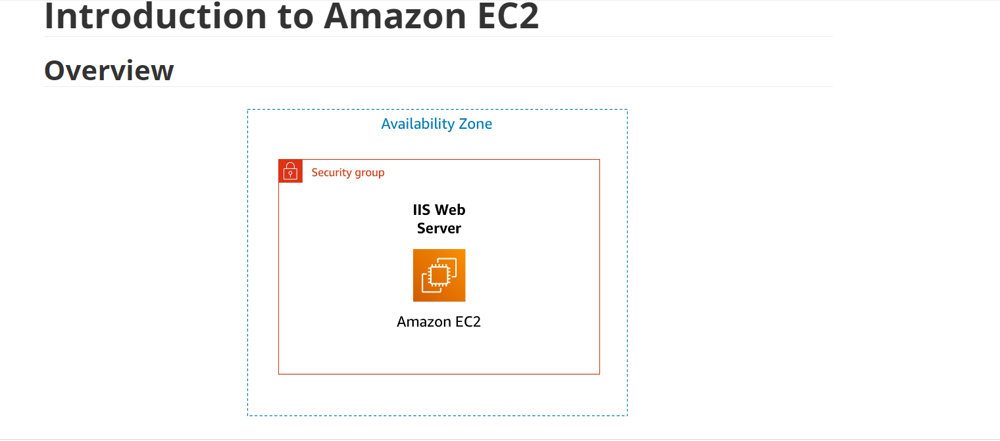

Amazon Elastic Compute Cloud (Amazon EC2) is a web service that provides resizable compute capacity in the cloud. It is designed to make web-scale cloud computing easier for developers.

Amazon EC2's simple web service interface allows you to obtain and configure capacity with minimal friction. It provides you with complete control of your computing resources and lets you run on Amazon's proven computing environment. Amazon EC2 reduces the time required to obtain and boot new server instances to minutes, allowing you to quickly scale capacity, both up and down, as your computing requirements change.

Amazon EC2 changes the economics of computing by allowing you to pay only for capacity that you actually use. Amazon EC2 provides developers the tools to build failure resilient applications and isolate themselves from common failure scenarios.

# Topics covered
By the end of this lab, you will be able to:

- Launch a web server with termination protection enabled

- Monitor Your EC2 instance

- Modify the security group that your web server is using to allow HTTP access

- Resize your Amazon EC2 instance to scale

- Test termination protection

- Terminate your EC2 instance

 

Duration
This lab takes approximately 45 minutes to complete.

Accessing the AWS Management Console
At the upper-right corner of these instructions, choose  Start Lab

Troubleshooting tip: If you get an Access Denied error, close the error box, and choose  Start Lab again.

The lab status can be interpreted as follows:

A red circle next to AWS  at the upper-left corner of this page indicates the lab has not been started.

A yellow circle next to AWS  at the upper-left corner of this page indicates the lab is starting.

A green circle next to AWS  at the upper-left corner of this page indicates the lab is ready.

Wait for the lab to be ready before proceeding.

At the top of these instructions, choose the green circle next to AWS 

This option opens the AWS Management Console in a new browser tab. The system automatically sign you in.

Tip: If a new browser tab does not open, a banner or icon at the top of your browser will indicate that your browser is preventing the site from opening pop-up windows. Choose the banner or icon, and choose Allow pop-ups.

Arrange the AWS Management Console tab so that it displays along side these instructions. Ideally, you should be able to see both browser tabs at the same time so that you can follow the lab steps.

 Do not change the lab Region unless specifically instructed to do so.

It takes a few minutes to provision the resources necessary to complete this lab.

 

Task 1: Launching your EC2 instance
  In this task, you will launch an Amazon EC2 instance with termination protection. Termination protection prevents you from accidentally terminating an EC2 instance. You will deploy your instance with a User Data script that will allow you to deploy a simple web server.

In the AWS Management Console on the Services menu, choose EC2.

In the left navigation pane, choose EC2 Dashboard to ensure that you are on the dashboard page.

Choose Launch instance, and then select Launch instance.

Step 1: Naming your EC2 instance
When you name your instance, AWS creates a key value pair. The key for this pair is Name, and the value is the name you enter for your EC2 instance.

In the Name and tags pane, in the Name text box, enter Web Server.

Step 2: Choosing an Amazon Machine Image (AMI)
An AMI provides the information required to launch an instance, which is a virtual server in the cloud. An AMI includes the following:

A template for the root volume for the instance (for example, an operating system or an application server with applications)

Launch permissions that control which AWS accounts can use the AMI to launch instances

A block device mapping that specifies the volumes to attach to the instance when it is launched

The Quick Start list contains the most commonly used AMIs. You can also create your own AMI or select an AMI from the AWS Marketplace, an online store where you can sell or buy software that runs on AWS.

Locate the Application and OS Images (Amazon Machine Image) pane. 

Under AMI Machine Image (AMI), notice that the Amazon Linux 2 AMI image is selected by default. Keep this setting.

Step 3: Choosing an instance type
Amazon EC2 provides a wide selection of instance types optimized to fit different use cases. Instance types comprise varying combinations of CPU, memory, storage, and networking capacity and give you the flexibility to choose the appropriate mix of resources for your applications. Each instance type includes one or more instance sizes so that you can scale your resources to the requirements of your target workload.

Select a t3.micro instance. This instance type has 2 virtual CPU and 1 GiB of memory.

From the dropdown, select t3.micro.

NOTE: You may be restricted from using other instance types in this lab.

Step 4: Configuring a key pair
Amazon EC2 uses public–key cryptography to encrypt and decrypt login information. To log in to your instance, you must create a key pair, specify the name of the key pair when you launch the instance, and provide the private key when you connect to the instance.

In this lab, you do not log in to your instance, so you do not require a key pair.

In the Key pair (login) pane, select Proceed without a key pair (Not recommended).

Step 5: Configuring the network settings 
You use this pane to configure networking settings.

The VPC indicates which virtual private cloud (VPC) you want to launch the instance into. You can have multiple VPCs, including different ones for development, testing, and production.

In the Network settings pane, choose Edit

For VPC - required, select Lab VPC.

Still in the Network settings pane, configure the Security Group as follows:

Security group name - required: Web Server security group

Description: Security group for my web server

A security group acts as a virtual firewall that controls the traffic for one or more instances. When you launch an instance, you associate one or more security groups with the instance. You add rules to each security group that allow traffic to or from its associated instances. You can modify the rules for a security group at any time; the new rules are automatically applied to all instances that are associated with the security group.

Under Inbound security groups rules select the Remove

In this lab, you will not log into your instance using SSH. Removing SSH access will improve the security of the instance.

Step 6: Adding storage
Amazon EC2 stores data on a network-attached virtual disk called Amazon Elastic Block Store (Amazon EBS).

You launch the EC2 instance using a default 8 GiB disk volume. This is your root volume (also known as a boot volume).

In the Configure storage pane, keep the default storage configuration.

Step 7: Configuring advanced details 
Expand the Advanced details pane.

Select the dropdown for Termination protection, then choose Enable.

When you launch an instance in Amazon EC2, you have the option of passing user data to the instance. These commands can be used to perform common automated configuration tasks and even run scripts after the instance starts. 

Copy the following commands, and paste them into the User data text box.

#!/bin/bash
yum -y install httpd
systemctl enable httpd
systemctl start httpd
echo '<html><h1>Hello From Your Web Server!</h1></html>' > /var/www/html/index.html
The script does the following:

Install an Apache web server (httpd)

Configure the web server to automatically start on boot

Activate the Web server

Create a simple web page

Step 8: Launching an EC2 instance
Now that you have configured your EC2 instance settings, it is time to launch your instance.

In the right pane, choose Launch instance

Choose View all instances

The instance appears in a Pending state, which means it is being launched. It then changes to Running, which indicates that the instance has started booting. There will be a short time before you can access the instance.

The instance receives a public DNS name that you can use to contact the instance from the Internet.

Select the  box next to your Web Server. The Details tab displays detailed information about your instance.

 To view more information in the Details tab, drag the window divider upward.

Review the information displayed in the Details, Security and Networking tabs.

Wait for your instance to display the following:

Note: Refresh if needed.

Instance State:  Running

Status Checks:   2/2 checks passed

Task 2: Monitor Your Instance
Monitoring is an important part of maintaining the reliability, availability, and performance of your Amazon Elastic Compute Cloud (Amazon EC2) instances and your AWS solutions.

Select the instance by checking the box next to the instance and navigate to the bottom of the screen to the Status checks tab.

 With instance status monitoring, you can quickly determine whether Amazon EC2 has detected any problems that might prevent your instances from running applications. Amazon EC2 performs automated checks on every running EC2 instance to identify hardware and software issues.

Notice that both the System reachability and Instance reachability checks have passed.

Select the Monitoring tab.

This tab displays Amazon CloudWatch metrics for your instance. Currently, there are not many metrics to display because the instance was recently launched.

You can choose a graph to see an expanded view.

 Amazon EC2 sends metrics to Amazon CloudWatch for your EC2 instances. Basic (five-minute) monitoring is enabled by default. You can enable detailed (one-minute) monitoring.

In the Actions  menu, select Monitor and troubleshoot  Get Instance Screenshot.

This shows you what your Amazon EC2 instance console would look like if a screen were attached to it.

Screen-shot

 If you are unable to reach your instance via SSH or RDP, you can capture a screenshot of your instance and view it as an image. This provides visibility as to the status of the instance, and allows for quicker troubleshooting.

Select Cancel located at the bottom of the instance screenshot.

 Congratulations! You have explored several ways to monitor your instance.

 

Task 3: Update Your Security Group and Access the Web Server
When you launched the EC2 instance, you provided a script that installed a web server and created a simple web page. In this task, you will access content from the web server.

Select the instance by checking the box and select the Details tab.

Copy the Public IPv4 address of your instance to your clipboard.

Open a new tab in your web browser, paste the IP address you just copied, then press Enter.

Question: Are you able to access your web server? Why not?

You are not currently able to access your web server because the security group is not permitting inbound traffic on port 80, which is used for HTTP web requests. This is a demonstration of using a security group as a firewall to restrict the network traffic that is allowed in and out of an instance.

To correct this, you will now update the security group to permit web traffic on port 80.

Keep the browser tab open, but return to the EC2 Management Console tab.

In the left navigation pane, select Security Groups located under Network & Security.

Select  Web Server security group.

Select the Inbound rules tab.

The security group currently has no rules.

Select Edit inbound rules then select Add rule and configure the rule with the following settings:

Type: HTTP

Source: Anywhere-IPv4

Select Save rules

Return to the web server tab that you previously opened and refresh  the page.

You should see the message Hello From Your Web Server!

 Congratulations! You have successfully modified your security group to permit HTTP traffic into your Amazon EC2 Instance.

 

Task 4: Resize Your Instance: Instance Type and EBS Volume
As your needs change, you might find that your instance is over-utilized (too small) or under-utilized (too large). If so, you can change the instance type. For example, if a t3.micro instance is too small for its workload, you can change it to an m5.medium instance. Similarly, you can change the size of a disk.

Stop Your Instance
Before you can resize an instance, you must stop it.

 When you stop an instance, it is shut down. There is no charge for a stopped EC2 instance, but the storage charge for attached Amazon EBS volumes remains.

On the EC2 Management Console, in the left navigation pane, select Instances.

 Web Server should already be selected.

Select Instance state > Stop instance.

Select Stop

Your instance will perform a normal shutdown and then will stop running.

Wait for the Instance State to display: stopped

Change The Instance Type
In the Actions  menu, select Instance Settings  Change Instance Type, then configure:

Instance Type: t3.small

Select Apply

When the instance is started again it will be a t3.small, which has twice as much memory as a t3.micro instance. NOTE: You may be restricted from using other instance types in this lab.

Resize the EBS Volume
In the left navigation menu, select Volumes located under Elastic Block Store.

Select the volume by checking the box, and navigate to the Actions  menu, select Modify Volume.

The disk volume currently has a size of 8 GiB. You will now increase the size of this disk.

Change the size to: 10 NOTE: You may be restricted from creating large Amazon EBS volumes in this lab.

Select Modify

Select Modify to confirm and increase the size of the volume.

Start the Resized Instance
You will now start the instance again, which will now have more memory and more disk space.

In left navigation pane, select Instances.

Select the Web Server instance by checking the box, then navigate to Instance state > Start instance.

Congratulations! You have successfully resized your Amazon EC2 Instance. In this task you changed your instance type from t3.micro to t3.small. You also modified your root disk volume from 8 GiB to 10 GiB.

 

 

Task 5: Test Termination Protection
You can delete your instance when you no longer need it. This is referred to as terminating your instance. You cannot connect to or restart an instance after it has been terminated.

In this task, you will learn how to use termination protection.

In left navigation pane, select Instances.

Select the Web Server instance by checking the box and navigate to the top and select Instance state  menu, select  Terminate instance.

Note: There is a message that says: On an EBS-backed instance, the default action is for the root EBS volume to be deleted when the instance is terminated. Storage on any local drives will be lost. It will ask if you are sure that you want to terminate the instance. You will be able to select the Terminate button.

Note: You will notice that the instance did not terminate and a red error message pops up at the top that says: Failed to terminate an instance: The instance may not be terminated. This is because it has termination protection enabled.

In the Actions  menu, select Instance settings  Change termination protection.

Uncheck  Enable followed by Save

You can now terminate the instance.

In the Actions  menu, select Instance State  Terminate instance.

Select Terminate

 Congratulations! You have successfully tested termination protection and terminated your instance.

 

Lab Complete 
Choose  End Lab at the top of this page, and then select Yes to confirm that you want to end the lab.

A panel indicates that DELETE has been initiated... You may close this message box now.

A message Ended AWS Lab Successfully is briefly displayed, indicating that the lab has ended.
​

Additional Resources
Launch Your Instance

Amazon EC2 Instance Types

Amazon Machine Images (AMI)

Amazon EC2 - User Data and Shell Scripts

Amazon EC2 Root Device Volume

Tagging Your Amazon EC2 Resources

Security Groups

Amazon EC2 Key Pairs

Status Checks for Your Instances

Getting Console Output and Rebooting Instances

Amazon EC2 Metrics and Dimensions

Resizing Your Instance

Stop and Start Your Instance

Terminate Your Instance

Termination Protection for an Instance

 

For more information about AWS Training and Certification, see https://aws.amazon.com/training/.